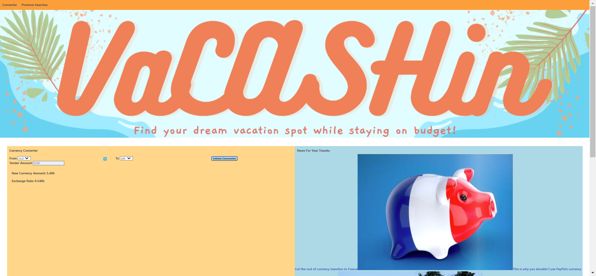

#  VaCASHin

## Description
This project was built in accordance with instructions provided via Northwestern University's Full-stack Development Coding Bootcamp's staff, with us writing code, using HTML, CSS, and Javascript to create a unique application of our own design as a group project.
​
To that end, we created an online currency converter application that also returns relavent articles to the currency an indiidual chose to convert their money to, ostensibly for the purpose of making exchanging currency easy and friendly for the traveler to know how far there money will take them. The VaCASHin app is designed to take the worry out of how much they will need to spend so you can focus on the fun of vacation/travel.
​
Technically speaking, we created javascript functions which, by using data taken from user inputs as queries for fetch requests, are capable of appending data retrievied from online, free serverside apis to an html page. Said data consists of the aforementioned exchanged currency's information and pertinent news articles.

# Screenshot of Deployed Application

